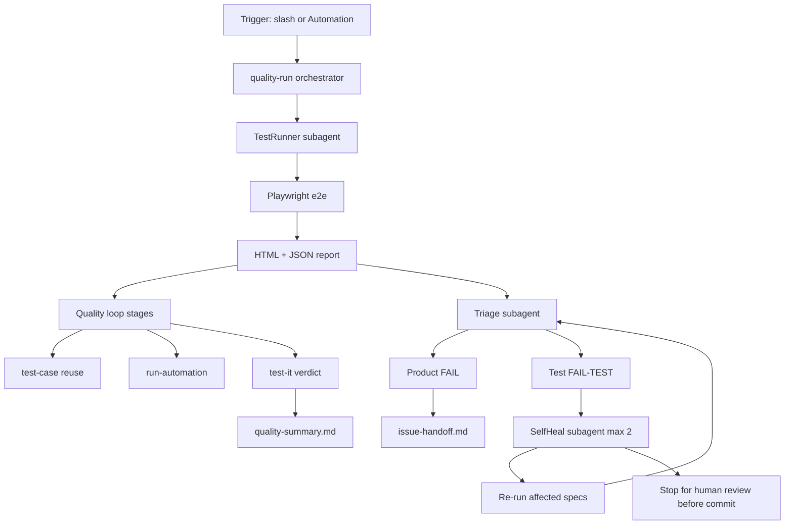

# Quality Automation + Self-Heal Plan

## Current state (what we build on)

- **Playwright suite:** [`e2e/`](e2e/) with committed specs for **US-001** and **US-002** only ([`e2e/src/specs/home/us-001.spec.ts`](e2e/src/specs/home/us-001.spec.ts), [`us-002.spec.ts`](e2e/src/specs/home/us-002.spec.ts)).
- **Quality loop contract:** [`CONTEXT.md`](CONTEXT.md) defines `test-case → automate → run-automation → test-it` with verdict rules (`PASS`, `FAIL`, `FAIL-TEST`, `BLOCKED`).
- **Existing artifacts:** per-story folders under [`.quality/us-001/`](.quality/us-001/) and [`.quality/us-002/`](.quality/us-002/) with `test-cases.md`, `automation-run-report.md`, `results.md`, `e2e-report.md`.
- **Gap:** [`e2e/playwright.config.ts`](e2e/playwright.config.ts) uses `list` reporter locally (no HTML report), no orchestrator, no triage/self-heal skills, no Cursor Automation wired to this repo.



---

## Phase 1 — Test execution + HTML reporting

### 1.1 Upgrade Playwright reporters

Update [`e2e/playwright.config.ts`](e2e/playwright.config.ts):

- Local: `reporter: [['list'], ['html', { open: 'never', outputFolder: 'playwright-report' }], ['json', { outputFile: 'test-results/results.json' }]]`
- CI: keep `github` reporter plus JSON for machine parsing.
- Add npm scripts in [`e2e/package.json`](e2e/package.json):
  - `test:report` — run all specs + emit HTML/JSON
  - `report:open` — `npx playwright show-report playwright-report`

### 1.2 Add a repo orchestrator script

Create [`scripts/quality-run.mjs`](scripts/quality-run.mjs) (single entry point for shell + agents):

| Flag | Behavior |
|------|----------|
| `--all` | Run full `e2e` suite |
| `--story us-002` / `--issue 4` | Map slug via [`scripts/issue-mapping.json`](scripts/issue-mapping.json) → grep/spec file |
| `--tc TC-01,TC-03` | Forward to `npm --prefix e2e test -- --grep=...` |
| `--spec path` | Run explicit spec file(s) |
| `--skip-env-check` | Assume static server already on :3000 |

Outputs (timestamped under `.quality/runs/<runId>/`):

- `playwright-report/` (copy or symlink from `e2e/playwright-report`)
- `results.json` (Playwright JSON)
- `stdout.txt`
- `run-manifest.json` (scope, commands, exit code, artifact paths)

This script is what **sub-agents and Automations call** — not ad-hoc npm commands.

---

## Phase 2 — Orchestration skill (slash command)

Create [`.cursor/skills/quality-run/SKILL.md`](.cursor/skills/quality-run/SKILL.md) as the developer-facing entry point:

```text
/quality-run                    → --all
/quality-run us-002             → story scope
/quality-run --tc TC-01,TC-02   → TC subset
/quality-run --no-heal          → triage only
/quality-run --auto             → non-interactive (for Automation)
```

**Sub-agent choreography** (parent agent delegates via `Task` tool):

| Subagent | Role | Inputs | Outputs |
|----------|------|--------|---------|
| `shell` | **TestRunner** | `node scripts/quality-run.mjs ...` | exit code, `run-manifest.json` |
| `generalPurpose` | **ReportAnalyzer** | HTML report dir + `results.json` + failing spec paths | `triage.json` per failure |
| `generalPurpose` | **SelfHealer** | only `classification: test-bug` rows | patched `e2e/src/**` files |
| `shell` | **ReRunner** | affected specs only | pass/fail after heal attempt |
| `generalPurpose` | **QualityLoop** | story slugs in scope | invokes existing skills: `/run-automation` → `/test-it` (reuse artifacts when present per [`CONTEXT.md`](CONTEXT.md)) |

Parent agent merges everything into `.quality/runs/<runId>/quality-summary.md` with:
- Playwright HTML report path (`e2e/playwright-report/index.html`)
- Per-failure classification + evidence links
- Self-heal attempts (what changed, re-run result)
- Quality loop verdict per story
- **Explicit stop gate:** "Review self-heal diffs before commit" (per your preference)

### Triage rules (encode in skill + `triage.json` schema)

Align with [`CONTEXT.md`](CONTEXT.md) § Product vs test failure:

| Signal | Likely classification |
|--------|----------------------|
| Assertion on visible copy/roles from [`e2e/src/business/*`](e2e/src/business/) mismatches **unchanged** AC in `test-cases.md` | **product-bug** |
| Selector/locator not found; URL `/start` vs `/start.html`; timing flake; page object drift; copy constant stale but product HTML changed intentionally | **test-bug** |
| Server not running / BLOCKED | **blocked** (no heal) |
| Ambiguous | **needs-review** (no auto-heal) |

`ReportAnalyzer` reads:
- Playwright JSON (`error`, `stdout`, `location`, `attachments`)
- Trace/screenshot paths from report
- Matching TC row in `.quality/<slug>/test-cases.md`
- Matching AC in GitHub issue body (via issue mapping)

---

## Phase 3 — Self-heal (max 2 attempts, no auto-commit)

Create [`.cursor/skills/test-heal/SKILL.md`](.cursor/skills/test-heal/SKILL.md):

**Allowed edit surfaces** (test bugs only):
- [`e2e/src/pages/*.ts`](e2e/src/pages/)
- [`e2e/src/business/*.ts`](e2e/src/business/)
- [`e2e/src/helpers/*.ts`](e2e/src/helpers/)
- Spec files only for wait/retry/step structure — **not** product code under `paper-trail/`

**Heal loop:**
1. Attempt 1: apply smallest fix (locator, URL helper, business copy constant, `waitFor` on navigation).
2. Re-run affected spec via `quality-run.mjs --spec ...`.
3. Attempt 2 (if still failing): broaden fix using trace + screenshot (e.g. case-insensitive text, scrollIntoView).
4. Stop — write `.quality/runs/<runId>/heal-report.md` with diff summary and instruction to review.

**Hard stops (never self-heal):**
- Classification `product-bug` or `needs-review`
- Failure in `paper-trail/` product HTML/JS
- Same test failed identically twice (prevent infinite loops)

For **product bugs**, write/update [`.quality/<slug>/issue-handoff.md`](.quality/us-002/results.md) using existing `/test-it` contract — do not edit product code automatically.

---

## Phase 4 — Quality loop integration

After Playwright run (and optional heal), run the **existing** loop for stories in scope:

1. **Reuse** existing `test-cases.md` when present (US-001, US-002 already have them).
2. **`/run-automation`** — execute mapped specs; write `automation-run-report.md`.
3. **`/test-it`** — manual TC pass + evidence; write `results.md` + verdict.
4. **`/e2e` report rollup** — write/update `.quality/<slug>/e2e-report.md` and [`.quality/README.md`](.quality/README.md).

For stories without specs yet (US-003+), orchestrator should:
- Run only what's automatable
- Mark others `SKIP` in summary with pointer to `/test-case` + `/automate`

Optional later: enable `test-all` in [`CONTEXT.md`](CONTEXT.md) `enabled` list for milestone gates.

---

## Phase 5 — Cursor Automation (scheduled / PR / manual)

Use the **automate skill** ([`~/.cursor/skills-cursor/automate/SKILL.md`](C:\Users\267055\.cursor\skills-cursor\automate\SKILL.md)) to create a Cursor Automation after repo files are committed.

**Recommended automation (both triggers you chose):**

| Automation | Trigger | Agent instructions |
|------------|---------|-------------------|
| `quality-run-manual` | Manual / webhook | Read [`.cursor/skills/quality-run/SKILL.md`](.cursor/skills/quality-run/SKILL.md); run `/quality-run --all --auto`; post summary with HTML report path + triage table |
| `quality-run-on-pr` | Git: PR opened/pushed to `semraozturk/sample_agentic_automation_framework` | Same, scoped to changed stories when detectable from diff (`e2e/`, `paper-trail/`, `.quality/`) else `--all` |

**Automation prompt essentials** (committed file references only after push):
- Start servers per [`.cursor/skills/start-servers/SKILL.md`](.cursor/skills/start-servers/SKILL.md) unless Playwright `webServer` handles it
- Delegate TestRunner / ReportAnalyzer / SelfHealer as sub-agents
- Never commit self-heal changes — leave diffs for human review
- On product bugs, append to `issue-handoff.md` and link Playwright trace

**Tools to enable in Automation editor:** none required beyond default agent (optionally `prComment` for PR automation to post triage summary).

---

## Phase 6 — Docs + CONTEXT updates

Update [`CONTEXT.md`](CONTEXT.md):
- Add `quality-run` and `test-heal` to adoption profile (or document as repo-local skills)
- Document artifact paths: `.quality/runs/<runId>/`
- Document HTML report open command: `npm --prefix e2e run report:open`

Add [`docs/quality-automation.md`](docs/quality-automation.md) (short operator guide):
- Slash commands
- How to open HTML report
- How to read `triage.json` / `quality-summary.md`
- Self-heal review workflow

---

## Implementation order

1. Playwright reporters + npm scripts (unblocks HTML report viewing)
2. `scripts/quality-run.mjs` + run manifest
3. `.cursor/skills/quality-run/SKILL.md` (sub-agent orchestration)
4. `.cursor/skills/test-heal/SKILL.md` (heal rules + 2-attempt cap)
5. Triage JSON schema + `quality-summary.md` template
6. CONTEXT.md + operator doc
7. Cursor Automation drafts (manual + PR) via automate skill

---

## Success criteria

- ` /quality-run --all` produces HTML report at `e2e/playwright-report/index.html` and a consolidated `.quality/runs/<runId>/quality-summary.md`
- Failures are classified as `product-bug`, `test-bug`, `blocked`, or `needs-review`
- Test bugs trigger up to **2** auto-fix/re-run cycles without committing
- Product bugs produce `issue-handoff.md` content, not test edits
- Quality loop artifacts (`automation-run-report.md`, `results.md`, `e2e-report.md`) update for scoped stories
- Cursor Automation can run the same flow with `--auto` on manual or PR trigger

---

## Out of scope (phase 2 ideas)

- Auto-commit self-heal branches
- Healing product code (`paper-trail/`) — belongs in `bug-fix` loop
- Generating specs for US-003+ (still `/automate` per story)
- GitHub Actions CI (can mirror `quality-run.mjs` later using same script)
