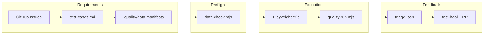

# Paper Trail — product + AI-ready quality engineering

[](https://github.com/semraozturk/sample_agentic_automation_framework/actions/workflows/e2e.yml)

**What you are looking at:** a portfolio-grade sample that ships a real static web product, production-style Playwright automation, and an agent-assisted quality loop built for Cursor — traceability from user story to test case to spec, proactive test-data gates, CI, and guarded self-heal. It is practice code, not a live product, but the patterns mirror what teams use on client engagements.

> **Design rule that drives everything:** nothing written to the tenancy log can be edited or deleted — only appended. Tests and data tooling respect the same “no rewriting history” idea where it matters (e.g. append-only lease ledger for one-time-use test data).

---

## Why this repo stands out (60-second pitch)

| Capability | What it shows |
|------------|----------------|
| **Separation of concerns** | Product HTML has zero npm; tests and tooling live elsewhere. |
| **Traceability** | GitHub Issues → `test-cases.md` → Playwright specs named `TC-NN: US-xxx-AC-n`. |
| **Data readiness** | Manifests declare what each scenario needs; checks run *before* the suite, not after a red run. |
| **Smart triage** | Failures classified as product vs test vs **data** vs environment — so you do not “heal” bad fixtures. |
| **AI ops that stay bounded** | Cursor **skills** encode workflows; **automations** run them on a schedule or webhook; hooks keep docs and data in sync. |
| **CI you can trust** | E2E on every PR: prereqs, traceability check, sample DB seed, data gate, Playwright + artifacts. |

**Live automation today:** Playwright covers **US-001** (home) and **US-002** (start form → log). Additional stories have test-case packs under `.quality/`; gaps are visible in the [traceability matrix](docs/traceability-matrix.md).

---

## Repository map — what each folder is for

| Folder | Purpose |
|--------|---------|
| [`paper-trail/`](paper-trail/README.md) | **Product** — static HTML/CSS/JS tenancy log (Stage A/B). No build step, no framework. |
| [`e2e/`](e2e/conventions.automation.md) | **Regression tests** — Playwright, page objects, specs tied to TC ids. |
| [`api/`](api/README.md) | **Stage C API** — small Node/Express append-only backend (optional; product stays static-first). |
| [`data/`](data/README.md) | **Sample test database** — SQLite schema, seed script, connection config for data-driven scenarios. |
| [`.quality/`](.quality/README.md) | **Quality artifacts** — per-story test cases, reports, screenshots, run archives under `runs/`. |
| [`.quality/data/`](docs/test-data-contract.md) | **Test-data manifests** — machine-readable datasets per story (`*.data.json`). |
| [`scripts/`](scripts/quality-run.mjs) | **CLI orchestration** — quality runs, triage, traceability matrix, data-check, issue helpers. |
| [`docs/`](docs/index.md) | **Published docs** — operator guides, traceability matrix, test-data contract (GitHub Pages). |
| [`.github/`](.github/workflows/e2e.yml) | **CI/CD** — E2E workflow, Pages deploy, artifacts on failure. |
| [`.cursor/`](.cursor/automations/README.md) | **Cursor agent setup** — skills, automation drafts, hooks, project rules (see below). |
| [`scripts/archive/`](scripts/archive/README.md) | **Historical scripts** — one-off migrations/exports, not part of the daily loop. |

**Root config:** [`CONTEXT.md`](CONTEXT.md) defines the quality loop and artifacts; [`project-context.md`](project-context.md) is stack metadata for tooling; [`.nvmrc`](.nvmrc) pins **Node 24** (built-in SQLite for data tooling).

---

## How the quality loop fits together



Human/agent stages (documented in [`CONTEXT.md`](CONTEXT.md)): refine → test-case → automate → **data-check** → run → triage → optional self-heal → report.

---

## Cursor — skills, automations, and guardrails

This repo is meant to be used **with Cursor agents**, not only from the terminal.

| Piece | Location | Role |
|-------|----------|------|
| **Skills** | [`.cursor/skills/`](.cursor/skills/quality-run/SKILL.md) | Repeatable playbooks: `/quality-run`, `/test-heal`, `/qa-refine`, `/data-check`, `/start-servers`. |
| **Automations** | [`.cursor/automations/`](.cursor/automations/README.md) | YAML **drafts** for Cursor Automations (manual quality run, QA refine, nightly data sweep). You register them at [cursor.com/automations](https://cursor.com/automations). |
| **Hooks** | [`.cursor/hooks.json`](.cursor/hooks.json) | Before Playwright: traceability sync, **test-data preflight**, dependency warnings. |
| **Rules** | [`.cursor/rules/`](.cursor/rules/repo-conventions.mdc) | Conventions for agents (story slices, naming, no rewriting the log). |

**Operator detail:** [docs/quality-automation.md](docs/quality-automation.md) · **Automations setup:** [.cursor/automations/README.md](.cursor/automations/README.md)

---

## Quick start

Requires **Node 24+** ([`.nvmrc`](.nvmrc)).

```bash
npm install --prefix e2e
npx --prefix e2e playwright install chromium
node data/seed.mjs --reset          # optional: sample DB for data-check demos
npm run data:check                  # validate declared test data
npm run test:e2e                    # Playwright suite
npm run quality:run                 # full harness + artifacts under .quality/runs/
```

| Command | What it does |
|---------|----------------|
| `npm run quality:report` | Open latest HTML report |
| `npm run docs:traceability` | Regenerate [docs/traceability-matrix.md](docs/traceability-matrix.md) |
| `npm run verify:prereqs` | Check files needed for Cursor automations |

---

## CI and documentation site

- **E2E:** [`.github/workflows/e2e.yml`](.github/workflows/e2e.yml) — prereqs, traceability `--check`, DB seed, data readiness, Playwright, reports as artifacts.
- **Docs site:** [`.github/workflows/pages.yml`](.github/workflows/pages.yml) publishes [`docs/`](docs/index.md) via GitHub Pages (enable **Settings → Pages → GitHub Actions** on a fork once).

**Exemplar end-to-end report:** [`.quality/us-002/e2e-report.md`](.quality/us-002/e2e-report.md)

---

## Forking or presenting this work

This repository is published at [semraozturk/sample_agentic_automation_framework](https://github.com/semraozturk/sample_agentic_automation_framework). The product and QA patterns are intentionally **portable**: manifests and `data-check` are framework-neutral; only the Playwright fixture binds data to specs.
