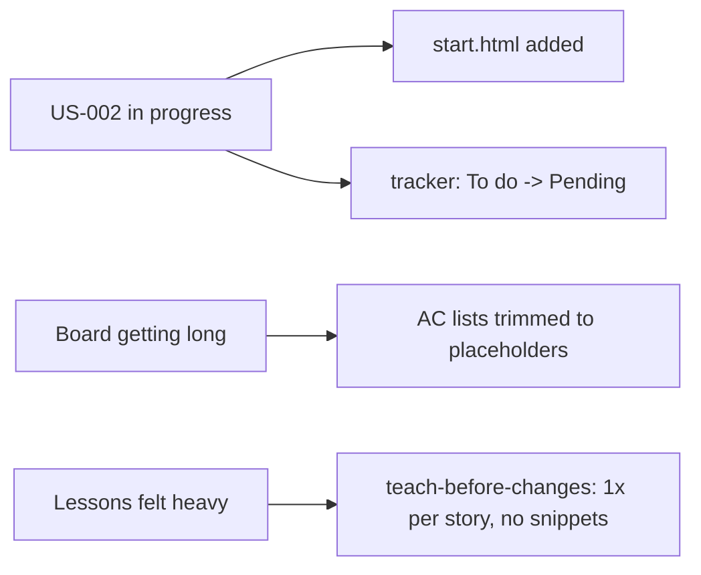

# Explain diff — start form, tracker trim, and skill rewrites (uncommitted, Sep 2, 2026)

> Note: the Notion MCP connection was stuck loading when this was generated,
> so this page was written locally instead of as a Notion page. Files touched
> (working tree, not yet committed):
>
> - `paper-trail/start.html` (new)
> - `paper-trail/index.html`
> - `paper-trail/lessons/index.html`
> - `paper-trail/tracker/index.html`
> - `paper-trail/tracker/README.md`
> - `.cursor/rules/repo-conventions.mdc`
> - `.cursor/skills/teach-before-changes/SKILL.md`
> - `.cursor/skills/teach-before-changes/lesson-template.html`
> - `.cursor/skills/start-servers/SKILL.md` (new)
> - `.cursor/skills/teach-before-changes/examples.md` (deleted)
> - `.cursor/rules/tracker-board.mdc` (deleted)

## Background

Paper Trail is a learning project for practicing web dev as a QA automation
engineer. It's staged deliberately:

- **Stage A** — static HTML pages only, no JavaScript, no storage.
- **Stage B** — adds `localStorage` and plain JS.
- **Stage C** — adds a real server.

The repo is currently in Stage A. Work is tracked as user stories (`US-001`,
`US-002`, ...) each with acceptance criteria (`US-002-AC-1`, etc.) on a
second mini-site at `paper-trail/tracker/index.html` — a backlog board that
mirrors what a Jira/ADO board would look like, but as flat HTML so it needs
no backend.

Two `.cursor/` mechanisms sit on top of the product code:

1. **`repo-conventions.mdc`** — an always-applied rule stating the ground
   rules (small slices, one stylesheet, the "nothing in the log can be
   edited" principle, naming).
2. **`teach-before-changes` skill** — after a user story's ACs are fully
   implemented, prepend a short teaching entry to
   `paper-trail/lessons/index.html` explaining what changed and why, then
   alert the user with a link. A stop hook (`lesson-check.js`) nags if a
   product-code turn ends without one.

## Intuition

This diff is really three unrelated things bundled into one working tree
snapshot:

1. **Product change** — US-002's first slice: the start-a-record form now
   exists as a real page (`start.html`) instead of just a link target. It
   collects address, move-in date, and deposit, but submitting it does
   nothing yet (no JS, no storage — that's later ACs of the same story).
2. **Tracker bookkeeping** — the board is updated to reflect that US-002 is
   now `Pending` (being worked on) instead of `To do`, and every *other*
   story's acceptance-criteria list has been collapsed behind a one-line
   "trimmed, see git history" placeholder to cut token usage, since the
   board file was getting large enough to matter for context budgets.
3. **Meta / tooling rewrite** — the `repo-conventions` rule and the
   `teach-before-changes` skill were both rewritten to be much shorter and
   to change *when* a lesson is written: previously a lesson was due after
   any small slice (even one AC) and required a code snippet + a
   part-by-part table; now a lesson is only due once a *whole* story's ACs
   are done, and it's just a couple of plain sentences — no snippets, no
   tables. A new `start-servers` skill was also added, documenting how to
   boot the one static file server this project needs.

The token-budget motive is the through-line: trimming the tracker's AC lists
and slimming the lesson format are both "say less, less often" moves so the
board and the lesson page don't balloon as more stories get built out.



## Code

### 1. The new start form (`paper-trail/start.html`)

A plain HTML `<form>` with three fields — `address`, `move-in` (a `date`
input), and `deposit` (a `number` input with `min="0" step="0.01"`) — and a
submit button. `method="get" action="start.html"` means submitting just
reloads the same page with the values in the query string; nothing is saved.
That's intentional for Stage A: validation and persistence are separate,
later ACs.

The page carries the same `<header>`/`<nav>`/`<footer>` shell and links the
shared `css/styles.css` as every other page, so it looks consistent without
any new CSS.

### 2. Home page copy tweak (`paper-trail/index.html`)

```125:132:paper-trail/index.html
      <p class="muted" style="margin-top: 16px">
        Stage A is screens only — nothing is saved yet. The start form is a
        page of fields; submit does not write a tenancy.
      </p>
```

The old copy said `start.html` was "the next story on the board" (true
before this change); now that the page exists, the copy was updated to
describe what it actually does (fields only, no save) instead of pointing at
a future file.

### 3. Tracker status change (`paper-trail/tracker/index.html`)

```80:87:paper-trail/tracker/index.html
              <td class="num">3</td>
              <td class="title"><a href="#US-002"><span class="row-id">US-002</span> Start form captures the tenancy</a></td>
              <td class="num"><span class="effort">M</span></td>
              <td data-testid="status-US-002"><span class="badge pending">Pending</span></td>
```

Same pattern is repeated at the feature-header badge and the story-detail
badge for `US-002`/`F-UI-2`, and the summary chip row now reads
`2 done · 1 pending · 28 to do` instead of `2 done · 0 pending · 29 to do`.
This is just the board catching up to reality: a story is `Pending` exactly
while someone is actively building it, per the rule already stated in the
tracker README.

### 4. Trimming every other story's acceptance criteria

Every story *other than* the one being worked on had its `<ul class="ac-list">`
of full Given/When/Then criteria replaced with a one-line placeholder:

```html
<details>
  <summary>Acceptance criteria (trimmed)</summary>
  <p class="ac-trimmed">3 criteria omitted to save tokens — restore from git history when this story is picked up.</p>
</details>
```

Nothing is lost — git history still has the full text — but the working
copy of the tracker file shrinks a lot, which matters because this whole
file gets read into context repeatedly while working the board.

### 5. `teach-before-changes` skill: shorter, and a different trigger

The trigger moved from *"after any small slice, possibly per-AC"* to
*"after a full user story's ACs are all done"*:

```1:20:.cursor/skills/teach-before-changes/SKILL.md
Not a commit checklist. **Trigger: a full user story is done** — every one of
its acceptance criteria implemented, not just one. Then prepend one short
entry to the lessons page and alert with the link.
```

The entry shape also lost its required code snippet + parts table + "new
words" glossary; it's now just a `<h2>` topic, a `Files:` line, and 2-4
plain sentences (see the rewritten `lesson-template.html`). The old version
optimized for teaching depth on every tiny change; the new version optimizes
for not interrupting mid-story and for cheaper lessons overall.

### 6. `repo-conventions.mdc`: same rules, referenced not restated

The rule file was reworded to be denser and to explicitly defer to the skill
file for the lesson trigger, rather than describing it twice:

```20:26:.cursor/rules/repo-conventions.mdc
## Small slices

One user story per turn (one AC if the story is large). Never implement
several stories before teaching. A teaching goes on the lessons page once a
full user story is done — not per AC — follow
`.cursor/skills/teach-before-changes/SKILL.md` rather than restating it here.
```

### 7. New `start-servers` skill

A small new skill documents the one command needed to view the site
(`npx --yes serve -l 3000` from `paper-trail/`) and the three URLs it serves
(home, `/tracker`, `/lessons`), plus a note to add a step here once Stage C
introduces a real backend. This didn't exist before — starting the server
was previously undocumented tribal knowledge.

## Verification

This is a static-HTML learning project with no test suite yet (`F-QA-1` /
`US-031` on the tracker is still "to do"). Verification here is manual:

1. Start the static server (`npx --yes serve -l 3000` from `paper-trail/`).
2. Open `http://localhost:3000` — confirm the "Stage A" copy under the
   action buttons reads the new wording.
3. Click **Start a record** — confirm `start.html` loads, shows the three
   fields, and submitting reloads the same page (URL gains a query string,
   nothing is persisted, no error).
4. Open `http://localhost:3000/tracker` — confirm `US-002` shows a
   **Pending** badge in the backlog table, the feature header, and the story
   detail, and confirm the meta-row chip reads `1 pending · 28 to do`.
5. Expand a *different* story's "Acceptance criteria" `<details>` (e.g.
   `US-004`) — confirm it shows the trimmed placeholder, not the full list.
6. Open `http://localhost:3000/lessons` — confirm the top entry is the new,
   shorter `US-002 · The start form` shape (files line + prose, no table).

No automated checks exist for any of this yet; `paper-trail/tracker/README.md`
lists `US-001-AC-1/AC-2`, `US-014-AC-2/AC-3/AC-5` as the suggested first
smoke checks once automation starts.

## Alternatives

**Trimming tracker ACs: placeholder text vs. splitting into multiple files**

| Placeholder text (chosen) | Split into per-story files |
|---|---|
| One file stays the single source of truth; simplest possible change | Board could `import`/link smaller files, keeping full ACs visible |
| Full detail temporarily invisible until picked back up (must go to git history) | More files to keep in sync; breaks "one page" simplicity the tracker README values |
| Zero new tooling or build step | Would likely need a build step or manual copy-paste, which conflicts with the "static HTML only" constraint |

**Lesson cadence: per-story vs. keeping per-AC**

| Per full story (chosen) | Per AC (previous) |
|---|---|
| Fewer, more coherent lessons; less interruption mid-story | Finer-grained, closer to the exact code that just landed |
| Risk: a big story's early ACs get less immediate reinforcement | Risk: many tiny lessons for what's really one concept, more token cost |
| Matches the repo rule that a slice is "one story, or one AC if large" without forcing a lesson at every internal step | Guaranteed a teaching moment right after every change, which is more consistent for a beginner but heavier to maintain |

## Quiz

1. Why does `start.html` use `method="get"` instead of `method="post"` for
   now?
   > It doesn't matter yet, either would work
     - Incorrect — the point isn't GET vs POST semantics; it's that Stage A
       has no server to receive a POST meaningfully at all.
   > Because Stage A has no JavaScript or server to save data, so submitting
   > just reloads the page with the values in the URL, and nothing is
   > actually persisted
     - Correct — persistence is a later Stage B/C concern; this slice only
       needed the fields to exist.

2. Why did stories *other than* `US-002` get their acceptance criteria
   collapsed to a placeholder instead of deleted outright?
   > Deleting them would break the HTML structure
     - Incorrect — deleting the `<ul>` would still leave valid HTML.
   > Git history already preserves the full text, so nothing is actually
   > lost by shrinking the working copy to save tokens
     - Correct — the tracker README/skill files explicitly rely on git as
       the archive, so pruning the live file is safe.

3. What changed about *when* `teach-before-changes` fires?
   > It now fires on every acceptance criterion instead of every story
     - Incorrect — that's backwards; it used to allow per-AC and now
       requires the whole story.
   > It now only fires once every acceptance criterion in a user story is
   > implemented, not after each individual AC
     - Correct — per the rewritten trigger section of the skill.

4. Why does `repo-conventions.mdc` point to `teach-before-changes/SKILL.md`
   instead of re-describing the lesson rules itself?
   > To avoid duplicating the same rule in two places where they could drift
   > out of sync
     - Correct — the rewritten rule explicitly says "follow ... rather than
       restating it here."
   > Because Cursor rules can't contain multi-step instructions
     - Incorrect — rules can contain arbitrary instructions; this was a
       deliberate de-duplication choice, not a technical limitation.

5. Why was a `start-servers` skill added rather than just telling the user
   the `npx serve` command once in chat?
   > So the exact command and the three URLs are documented and repeatable
   > any time someone (or the agent) needs to start viewing the site,
   > instead of relying on it being remembered
     - Correct — skills persist knowledge across sessions; a one-off chat
       message would be lost.
   > Because `npx serve` requires a skill file to run at all
     - Incorrect — `npx serve` is just a shell command; the skill only
       documents it, it doesn't enable it.
