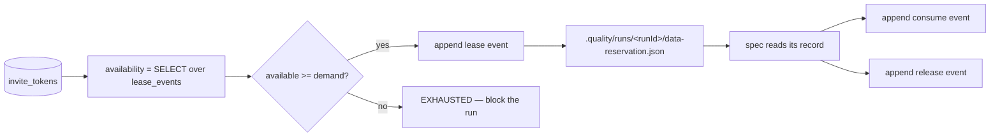

# Test data contract (v1)

A stack-agnostic way to declare, validate, and lease the data test scenarios need — so a
run fails on the product, not on stale or drained fixtures.

Nothing in layers 1 to 3 imports Playwright. Porting to another framework means writing
layer 4 only.

| Layer | Where | Portable |
|-------|-------|----------|
| 1 Manifest | `.quality/data/<slug>.data.json` | yes |
| 2 Adapters | `scripts/data/adapters/<kind>.mjs` | yes |
| 3 Checks | `scripts/data/checks/*.mjs` | yes |
| 4 Binding | `e2e/src/fixtures/paper-trail.ts` | no — one per framework |

## Why declare data at all

Before this contract, a TC's data lived in two places that could not be compared: prose in
the `Test Data` column of `.quality/<slug>/test-cases.md`, and a string literal in a spec.
A record that expired, a pool that drained, or a column that changed type surfaced only as
a red run, and triage had to guess whether the product or the fixture was at fault.

A manifest makes data checkable before the suite starts, which is the whole point:
**preventable data failures should never reach a test run.**

## Layer 1 — manifest

One file per story, schema at [.quality/data/manifest.schema.json](../.quality/data/manifest.schema.json).
Examples: [us-001](../.quality/data/us-001.data.json), [us-002](../.quality/data/us-002.data.json).

```json
{
  "version": 1,
  "story": "us-002",
  "datasets": [
    {
      "id": "DS-us-002-03",
      "usedBy": ["TC-03"],
      "traces": ["US-002-AC-3"],
      "entity": "tenancy",
      "lifecycle": "reusable",
      "source": { "kind": "static" },
      "fields": {
        "address": { "type": "string", "required": true, "minLength": 3 },
        "moveIn": { "type": "date", "required": true, "notAfter": "today" }
      },
      "records": [{ "address": "42 Test Lane", "moveIn": "2026-08-01" }]
    }
  ]
}
```

Dataset ids follow the same rule as stories and TCs: `DS-<slug>-NN`, never renumbered,
never reused.

### lifecycle is the load-bearing field

| Value | Meaning | Contract |
|-------|---------|----------|
| `reusable` | The test reads it and leaves it alone | Safe to share across runs and workers |
| `mutating` | The test changes it | `teardown` is required, or the manifest is invalid |
| `one-time-use` | The test consumes it; it is gone afterwards | Must be leased; `demandPerRun` is required |

`one-time-use` is the case that quietly breaks suites at scale. A magic link, an invite
token, a single-use voucher: the hundredth run finds the pool empty. `minAvailable` turns
that into a warning while there is still time to act.

### Field types

`string`, `number`, `integer`, `boolean`, `date`, `datetime`, `email`, `uuid`, `currency`,
`enum`.

Constraints: `required`, `unique`, `nullable`, `minLength`, `maxLength`, `min`, `max`,
`pattern`, `values`, `notBefore`, `notAfter`, `future`, `secret`.

`required: true` means present **and non-empty** — an empty string is treated as absent, so
a negative-path dataset declares its fields optional (see `DS-us-002-02`).

`notBefore` and `notAfter` accept an ISO date or the keyword `today`.

## Layer 2 — adapters

One module per source kind, each exporting the same functions. A new source is roughly
sixty lines.

| Function | Returns | Notes |
|----------|---------|-------|
| `probe(ctx)` | `{ ok, detail, latencyMs }` | Is the source reachable at all |
| `describe(dataset, ctx)` | `{ fields }` | Actual shape, for declared-vs-actual drift |
| `fetch(dataset, ctx)` | `{ records }` | Read candidates **without consuming** |
| `count(dataset, ctx)` | `{ available, total }` | Availability for `one-time-use` |
| `lease(dataset, n, ctx)` | `{ leases }` | Atomic claim; only `db` implements it |
| `release(leaseIds, ctx)` | `{ released }` | Return unused claims |

| Kind | Source | Live |
|------|--------|------|
| `static` | Inline `records` in the manifest | yes |
| `generated` | Deterministic generator, seeded per dataset | yes |
| `db` | SQLite via built-in `node:sqlite` | yes |
| `api` | Stage C REST API in [api/](../api/) | probe + fetch |
| `env` | Environment variables (config, credentials) | yes |

`generated` is seeded from `runId + dataset.id`, never from a clock or `Math.random`, so a
failure can be reproduced by replaying the run id.

Adapters must never consume data in `fetch` or `count`. Only `lease` consumes, and only
through the append-only ledger.

## Layer 3 — checks

Independent rules in `scripts/data/checks/`, each `{ id, title, severity, appliesTo, run }`.
Adding a rule means dropping in a file — no changes to the runner. `DC-00` is the
exception: manifest shape is validated during load, because a malformed manifest cannot
be handed to a check.

| Id | Checks | Severity |
|----|--------|----------|
| `DC-00` | Manifest shape: ids, enums, source keys, lifecycle obligations | error |
| `DC-01` | Source is reachable | error |
| `DC-02` | Records match declared field types and required-ness | error |
| `DC-03` | Domain rules: date order, non-negative amounts, enum membership | error |
| `DC-04` | Freshness: `expiresAt` in the future, not past `staleAfterDays` | error |
| `DC-05` | Uniqueness: no duplicate `unique` values, no cross-dataset collisions | error |
| `DC-06` | Sufficiency: `available >= demandPerRun x workers x (retries + 1)` | error |
| `DC-07` | Referential integrity: every `dependsOn` parent resolves | error |
| `DC-08` | Coverage: manifests and `test-cases.md` agree; no orphan datasets | warn |
| `DC-09` | Isolation: `mutating` datasets declare teardown | error |
| `DC-10` | Secrets hygiene: no credential-shaped literals in manifests | error |

`DC-08` runs for every story that has a `test-cases.md`, including stories with no
manifest at all — a story shipping data-bearing TCs and no manifest is exactly the gap
that manifests alone cannot reveal.

When `DC-01` reports an unreachable source, the remaining checks for that dataset are
skipped: they would only describe the silence.

### Verdicts

| Verdict | Meaning | Blocks a run |
|---------|---------|--------------|
| `READY` | All checks pass | no |
| `DEGRADED` | Warnings only, e.g. pool below `minAvailable` | only with `--strict` |
| `EXHAUSTED` | A `one-time-use` pool cannot cover this run | yes |
| `UNREACHABLE` | Source did not answer | yes |
| `INVALID` | Manifest or record shape is wrong | yes |

Exit codes from `scripts/data-check.mjs`: `0` ready, `1` blocking, `2` degraded only.

## Leasing and the append-only ledger

One-time-use records are claimed before the suite starts, not mid-run, so a shortage is a
clean refusal instead of a half-red suite.

The ledger is **insert-only** — `lease_events` rows are appended and availability is a
`SELECT` over them. Nothing is ever updated or deleted, matching this repo's one rule:
a correction is a new event, never a rewrite. `UPDATE` and `DELETE` are blocked by
triggers in [data/schema.sql](../data/schema.sql), so this is enforced by the database and
not by convention. `node data/seed.mjs --verify` proves it.

Claims run inside `BEGIN IMMEDIATE`, so two parallel workers cannot take the same record —
one waits, and each gets a different token.

Phase order matters: `--top-up` runs **before** the checks, so the report describes the
refilled pool; `--reserve` runs **after** them, so a dataset that failed validation is
never leased.



### The reservation file

`--reserve` writes every record the run may use into one file, so the suite never queries
a source itself:

```json
{
  "runId": "run-2026-09-11T15-30-00Z",
  "workers": 1,
  "retries": 0,
  "datasets": {
    "DS-us-002-03": { "lifecycle": "reusable", "records": [{ "address": "42 Test Lane", "moveIn": "2026-08-01" }] },
    "DS-one-time-use-01": { "lifecycle": "one-time-use", "records": [{ "token": "f9a2a02c-…" }] }
  },
  "leases": [{ "datasetId": "DS-one-time-use-01", "leaseId": 1, "recordKey": "f9a2a02c-…" }]
}
```

`.quality/tmp/data-reservation-latest.json` points at the newest run, so a binding can
find its reservation without being told a run id.

**Both sides must agree on the worker count.** The reservation is sized as
`demandPerRun x workers x (retries + 1)`, so if the gate assumes one worker and the suite
starts four, three of them find nothing. Set `PLAYWRIGHT_WORKERS` once and both
`data-check.mjs` and [e2e/playwright.config.ts](../e2e/playwright.config.ts) read it; CI
sets it at the job level. When it is unset and a one-time-use dataset is in scope, `DC-06`
warns that the count was assumed rather than stated.

## Layer 4 — framework binding

The only framework-specific piece. It reads
`.quality/runs/<runId>/data-reservation.json` and hands records to tests.

In Playwright that is a fixture ([e2e/src/fixtures/paper-trail.ts](../e2e/src/fixtures/paper-trail.ts)):

```ts
test("TC-03: US-002-AC-3 …", async ({ page, data }) => {
  const tenancy = data("DS-us-002-03");
  await start.fillAndSubmit({ address: tenancy.address, moveIn: tenancy.moveIn });
});
```

A missing dataset throws with the dataset id and a pointer to `data-check`, so the failure
names the cause instead of looking like locator drift.

## Porting to another framework

1. Keep layers 1 to 3 as they are. The runner is plain Node with no test-framework import.
2. Run `node scripts/data-check.mjs --story <slug> --reserve --run-id <id>` in the pipeline
   before the suite, and fail the stage on exit code `1`.
3. Write the binding for your runner, reading the same reservation file:

| Framework | Binding |
|-----------|---------|
| Playwright | worker fixture (this repo) |
| Cypress | `before` task reading the reservation via `cy.task` |
| pytest | session-scoped fixture returning a `dict` by dataset id |
| JUnit / RestAssured | `@BeforeAll` loader into a static registry |

4. Add adapters for sources your stack has that this one does not (Kafka, S3, a second
   database). Implement the six functions; the check registry needs no changes.

## Running it

```bash
node scripts/data-check.mjs --all                 # every manifest
node scripts/data-check.mjs --story us-002        # one story
node scripts/data-check.mjs --story us-002 --strict
node scripts/data-check.mjs --all --reserve --run-id run-2026...
node scripts/data-check.mjs --top-up             # refill pools below minAvailable
node scripts/data-check.mjs --all --json         # machine-readable
```

Reports land in `.quality/runs/<runId>/data-readiness.json` and `data-readiness.md`. The
`Checked` column reads `cached` when a local, deterministic dataset was skipped because
its manifest hash already passed today; remote sources are always probed live.

### Seeing the checks fire

[.quality/data/examples/](../.quality/data/examples/) holds manifests that break rules on
purpose. They are outside the discovery path, so only an explicit `--manifest` picks them
up:

```bash
node scripts/data-check.mjs --manifest .quality/data/examples/findings.data.json
```

Skill: [.cursor/skills/data-check/SKILL.md](../.cursor/skills/data-check/SKILL.md)
